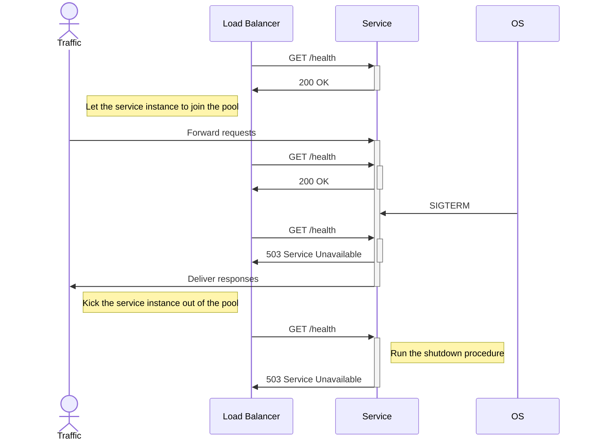

# fastify-graceful-healthcheck

[](https://www.npmjs.com/package/fastify-graceful-healthcheck)
[](https://www.npmjs.com/package/fastify-graceful-healthcheck)

A fastify plugin to take care of the shutdown procedure of services that live behind a load balancer.
This plugin will not initiate the shutdown process until it lets the load balancer know that it is shutting down. This way, the load balancer will not send any more requests to the server while it is shutting down and clients will not experience any downtime.



## Install

```bash
npm i fastify-graceful-healthcheck
```

## Usage

```js
const fastify = require("fastify")();
const gracefulHealthCheck = require("fastify-graceful-healthcheck");

await fastify.register(gracefulHealthCheck, {
  endpoint: "/health",
  timeout: 10000,
  onShutdown: async () => {
    console.log("cleanup finished, server is shutting down");
    await fastify.close();
    process.exit(0);
  },
});
```

## Options

| Name       | Type             | Default   | Description                                                 |
| ---------- | ---------------- | --------- | ----------------------------------------------------------- |
| endpoint   | `string`         | `/health` | The endpoint to check the health of the server.             |
| onShutdown | `async function` | -         | The async function to run when the server is shutting down. |
| timeout    | `number`         | `25000`   | The timeout for the shutdown procedure in miliseconds       |

Note:

1. The `onShutdown` function will be called only once, the default procedure is to close the fastify instance.
2. Try to keep the `endpoint` to be known only to the load balancer to avoid the outside world from interfering with the shutdown process.
